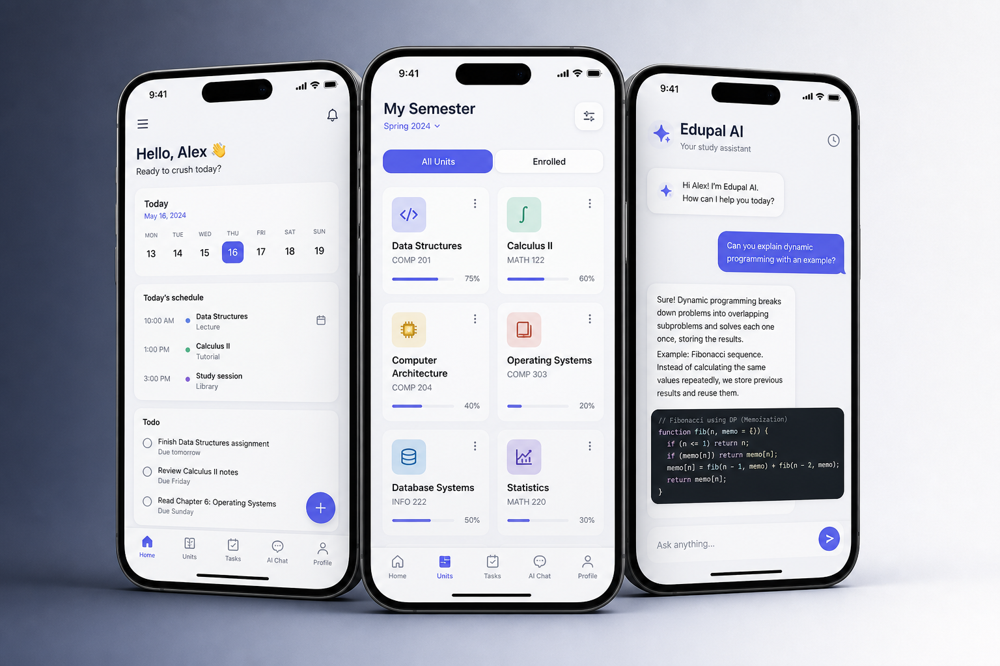
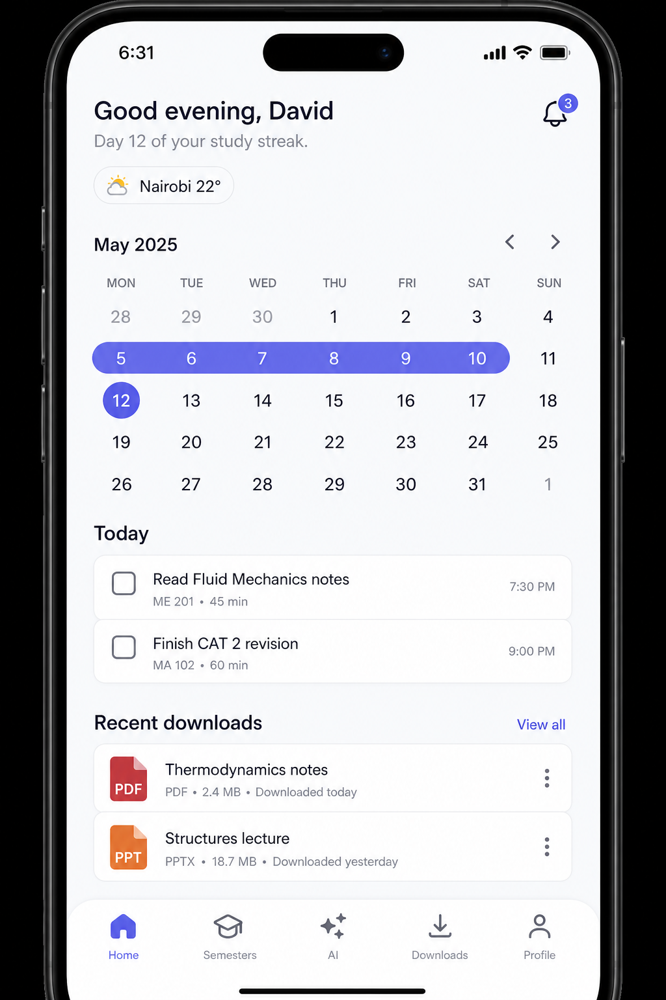
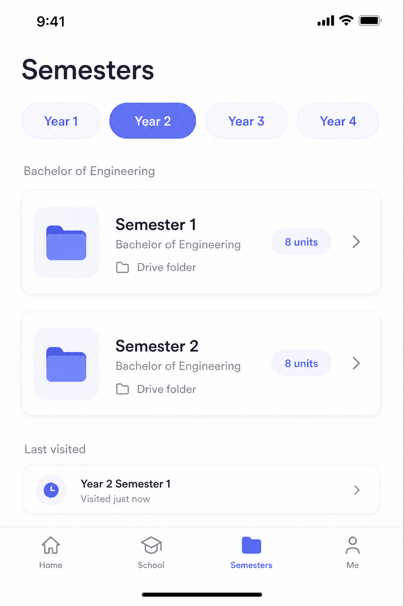
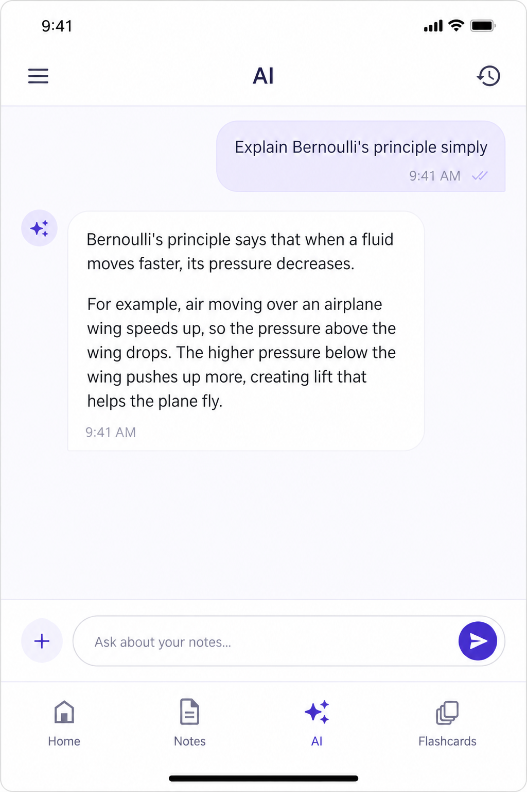

# Edupal

A Flutter university study app for browsing course materials, reading and downloading files, keeping a study streak, and chatting with an AI tutor. The app is branded **Edupal** in the about text and **UniStudy** in the Flutter title.

<p align="center">
  
</p>

Students sign in, get assigned to a course from their registration number, then walk year → semester → unit → files stored on Google Drive. Staff and class reps can upload, organize folders, and send notifications. A small backend (Edupal API on Render) handles uploads, AI chat, Drive storage, and weather.

## Screens

| Home | Semesters | AI |
| --- | --- | --- |
|  |  |  |

## How it works

```
┌─────────────┐     Firebase Auth      ┌──────────────┐
│  Sign in    │  email / Google        │   Profiles   │
│  AuthScreen │ ─────────────────────► │  Firestore   │
└─────────────┘                        └──────┬───────┘
                                              │
                    role, course, suspended, streak
                                              ▼
┌─────────────────────────────────────────────────────────────┐
│                     Main tabs (IndexedStack)                 │
│  Home · Semesters · AI · Downloads · Profile                 │
└────────────┬──────────────┬──────────────┬──────────────────┘
             │              │              │
             ▼              ▼              ▼
      Local todos,     Course years &    POST /ai/chat
      weather,         Drive folders     with Firebase
      streak,          (Drive API key)   ID token
      notifications
             │              │
             ▼              ▼
      Downloads on     Files open in
      device /         in-app PDF/image
      phone files      reader or externally
```

### Startup

1. Load `.env`, initialize Firebase, restore light/dark theme.
2. **App update gate** can force an in-app update before anything else.
3. **Auth gate** watches Firebase Auth:
   - signed out → login / sign up
   - signed in but missing name or registration number → complete profile
   - `suspended` on the profile → blocked screen
   - otherwise → main shell

New Google accounts that are missing profile fields land on the same auth screen with those fields prefilled.

### Courses and Drive

Courses live in Firestore (`CourseService`). Each course has a Drive root folder and a map of semester folder IDs (`year1_sem1`, …). The registration number prefix (for example `EB24` in `EB24/56171/21`) is used to match a student to a course.

On **Semesters**, the user picks a year, then a semester. That opens the Drive folder for that term: unit folders, then study files (PDF, Office, images). Non-students can create/rename/delete unit folders and upload files (max 20 MB) through the backend, which writes to Drive.

Drive listing uses a Google Drive API key from `.env`. Uploads, deletes, and AI go through `https://edupal-backend.onrender.com` with a Firebase ID token.

### Home

- Time-based greeting and **study streak** (recorded in Firestore when the app is opened).
- Weather for the user’s location (via the backend).
- Month calendar with streak days highlighted.
- Per-day **todos** (local).
- Recent downloads and unread **notifications**.
- Shortcut to browse documents already on the phone.

### AI

Conversations are stored on the device. Messages (and optional photos) are sent to `POST /ai/chat`. History can be listed in a sidebar. The Semesters and AI tabs require a network connection.

### Downloads and reader

Downloaded Drive files are tracked locally. PDFs and images open in the in-app reader; other types open with an external app. Users can also pick files from the phone (with All Files access on Android).

### Profile, roles, and admin

| Role | Typical access |
| --- | --- |
| `student` | Browse, download, AI, todos, own profile |
| `class_rep` / `assistant_class_rep` | Same, plus class members and posting notifications |
| `lecturer` / `admin` | Course members, uploads, notifications |
| `system_admin` | Users, courses, Drive storage, signup policy, suspend accounts |

Theme, help & support, feedback, and (for admins) the system dashboard live under Profile. Forced account updates are driven by `assets/app_version.json`.

### Connectivity and layout

Offline, Semesters and AI are blocked with a dedicated no-internet screen. Home and Downloads still work with local data. Screens use an adaptive layout for phones and tablets.

## Project layout

```
lib/
  main.dart                 # Theme, update gate, auth gate, bottom nav
  login/auth_screen.dart
  screens/                  # Home, semesters, AI, downloads, profile, admin, …
  services/                 # Auth, courses, Drive, upload, AI, downloads, …
  ui/adaptive_layout.dart
assets/                     # Splash, launcher icon, app_version.json
```

## Run locally

You need Flutter 3, a Firebase project (Auth + Firestore), and a `.env` next to `pubspec.yaml`. Start from `.env.example`:

```
GOOGLE_DRIVE_API_KEY=...
GOOGLE_DRIVE_DOWNLOAD_API_KEY=...
```

Backend-only keys (NVIDIA, Cloudinary, OpenWeather, Drive root folder) belong on the server, not in the client build.

```bash
flutter pub get
flutter run
```

Android and iOS launcher icons and splash are generated from `assets/app_icon.png` and `assets/splash_logo.png` via `flutter_launcher_icons` and `flutter_native_splash`.

## Stack

- **Flutter** (Material 3, Provider-ready, light/dark)
- **Firebase** Auth, Firestore, Google Sign-In
- **Google Drive** for course files
- **Edupal backend** for upload, AI, weather, and storage stats
- **Syncfusion PDF viewer**, file picker, image cropper, WebView
